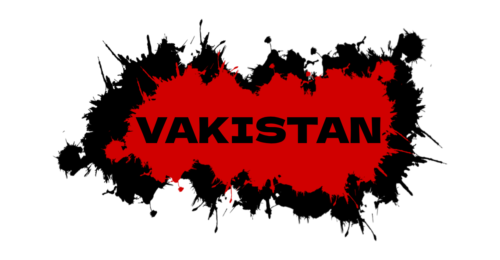

  
  
  logo will change in future

# VoikaStan
Multiplayer 2D shooter inspired by [Homigrad](https://github.com/sadsalat/Orignal-Homigrad)/[Bloodshed](https://steamcommunity.com/sharedfiles/filedetails/?id=3508448413)

# GameModes
*Police will arive after 2 minutes of 3-7 shoot*
*Some modes not completed now*

| Name | Description |
|---|---|
| Default |  A mode where you play as a traitor equipped with numerous traps and a knife. Your goal is to eliminate all innocents as well as the armed defender |
| Massacre | One of the players becomes a shooter, after which his task is to kill absolutely everyone before the police arrive |
| FFA | Just a deathmatch with random weapons |
| Infection | A mode where you must survive until evacuation from infected zombies. Hold out and stay alive—because if you die, you’ll become the very thing you were shooting at |
| Riot | A Team Deathmatch with a melee, where 50% player its a extremists and another 50% its a police |

# Maps creating
For creating maps, use [LDtk](https://ldtk.io/) and convert ldtk map to archive .zip (archive .ldtk and textures to .zip)
